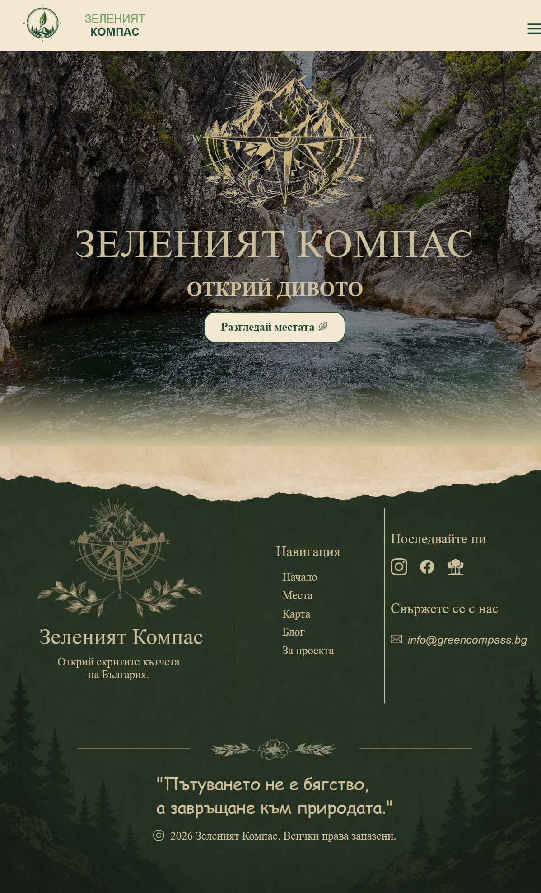
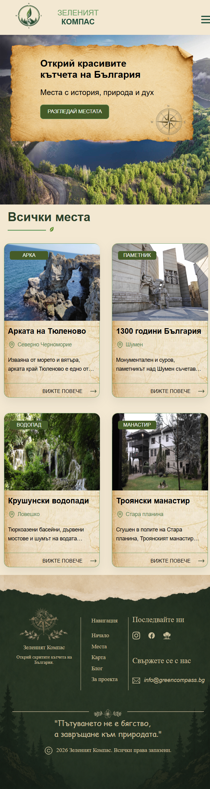
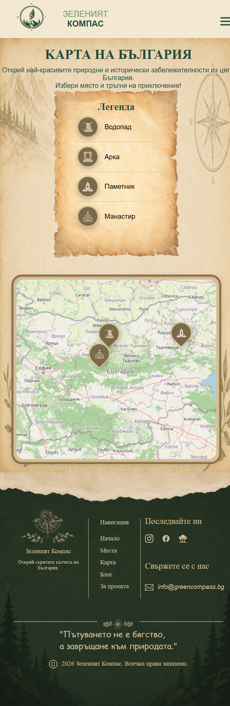

# 🌿 Зеленият Компас (Green Compass)

Открий природните и историческите съкровища на България.

**Зеленият Компас** е уеб приложение, което събира на едно място красиви природни забележителности, исторически обекти и вдъхновение за пътуване из България.
Проектът е създаден с идея за спокойна навигация, винтидж визия и лесно откриване на нови дестинации.

<hr />

### ✨ Основни функционалности

🧭 Разглеждане на интересни места в България </br>
🗺️ Интерактивна карта с персонализирани маркери</br>
📍 Подробна информация за всяка дестинация</br>
🖼️ Галерия със снимки</br>
🚗 Информация за достъп (с кола / пеша)</br>
📖 Блог секция с идеи и вдъхновение</br>
📱 Responsive дизайн</br>

<hr />

### 🛠️ Използвани технологии</br>
#### Frontend
- React
- React Router
- CSS Modules
- Leaflet (карта)
- Vite
#### Backend
- Node.js
- Express
#### Database
- PostgreSQL
  
  <hr />
### 📁 Структура на проекта
```plaintext
green-compass/
│
├── client/
│   ├── src/
│       ├── api/
│       ├── assets/
│       ├── components/
│       └── utils/
│
├── server/
│   ├── db.js
│   └── server.js
│
└── README.md
```
<hr />

### 🚀 Стартиране локално
#### 1. Клониране
   
git clone https://github.com/your-username/green-compass.git

cd green-compass

<hr />

#### 2. Инсталиране

Frontend:

cd client <br />
npm install <br />
npm run dev <br />

Backend:

cd server <br />
npm install <br />
npm run start <br />

<hr />

### ⚙️ Environment Variables

Създай `.env` файл в `server/`

DB_USER= <br />
DB_PASSWORD= <br />
DB_HOST= <br />
DB_PORT= <br />
DB_NAME= <br />
 
<hr />

### 🗺️ Данни за местата

Всяка дестинация съдържа:

+ name
+ description
+ content
+ practical_info
+ coordinates
+ access
+ gallery
+ hero_img

<hr />

### 📸 Галерия

Добави изображения тук:





<!--  -->

<hr />

### 🌱 Идеи за бъдещо развитие

+ Блог страница
+ Филтриране по категории
+ Любими места
+ Потребителски профили
+ Коментари
+ Тъмна тема
+ Търсене по регион

<hr />

### 👩‍💻 Автор

Създадено от **Ива Кръстева**

<hr />

> „Пътувай отговорно. Опознавай с уважение.“